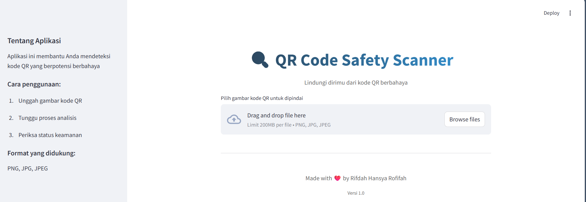

# QR‑PHISHING‑PREDICT 🔒  
**Detects Threats, Secures QR Codes Instantly**

[](https://github.com/rifdahhhh/qr-phishing-predict/commits/main)
[]()
[]()

**Built with the following tools and technologies:**  


---

## 📌 Overview

**QR-Phishing-Predict** is an intelligent threat detection system that identifies phishing attacks embedded in QR codes, commonly referred to as **quishing**. Instead of decoding the embedded URL, this model focuses on analyzing the **visual patterns and pixel structure** of the QR image to predict whether it is **safe** or **malicious**.

The model was trained using the dataset from Kaggle:  
📂 [Benign and Malicious QR Codes Dataset](https://www.kaggle.com/datasets/samahsadiq/benign-and-malicious-qr-codes)

---

## 🧠 Key Features

- Predicts phishing attacks based on QR code image structure without decoding the URL
- Built with deep learning frameworks (TensorFlow + Keras)
- Streamlit-based web application for intuitive interaction
- Automated prediction with clear output indicators
- Modular design for easy retraining and model replacement

---

## 🗂️ Project Structure

```text
/
├── dashboard/main.py      # Streamlit web interface
├── images/                # UI images and resources
├── model/                 # Saved models and model logic
├── notebook/              # Jupyter notebooks for experimentation
├── requirements.txt       # Python dependencies
└── README.md              # This documentation
````

---

## 🚀 Getting Started

### ✅ Prerequisites

* Python 3.8 or newer
* pip or pipenv

### 🔧 Installation

```bash
git clone https://github.com/rifdahhhh/qr-phishing-predict.git
cd qr-phishing-predict
pip install -r requirements.txt
```

### ▶️ Run the Web App

```bash
streamlit run dashboard/main.py
```

Then open your browser at: [http://localhost:8501](http://localhost:8501)

---

## 📊 How It Works

1. Users upload a QR code image through the Streamlit interface.
2. The image is processed to extract pixel-level features.
3. The model makes a prediction using visual-based classification.
4. The result is displayed with a label:

   * ✅ **Safe**
   * ⚠️ **Phishing Suspected**

> Note: This model does **not** decode the QR content or analyze URLs. It strictly performs prediction based on image features.

---

## 📈 Model Performance

The model was trained and evaluated using standard metrics. The results are as follows:

* **Training Accuracy**: 95.67%
* **Training Loss**: 0.0750
* **Validation Accuracy**: 96.04%
* **Validation Loss**: 0.0814

These results indicate the model is highly capable of distinguishing malicious from benign QR codes based solely on image structure.

---

## 🛠️ Built With

* [TensorFlow](https://www.tensorflow.org/)
* [Keras](https://keras.io/)
* [Scikit-learn](https://scikit-learn.org/)
* [Streamlit](https://streamlit.io/)
* [Pandas](https://pandas.pydata.org/)
* [NumPy](https://numpy.org/)
* [tqdm](https://tqdm.github.io/)

---

## ⚠️ Limitations

* Does not decode QR codes or analyze actual URLs.
* May be less effective on adversarial QR code designs.
* Not tested on all QR styles (e.g., logos, artistic patterns).
* Intended for research and educational purposes only—not a production-ready security tool.

---

## 📚 References

* Samah Sadiq. [Benign and Malicious QR Codes Dataset – Kaggle](https://www.kaggle.com/datasets/samahsadiq/benign-and-malicious-qr-codes)
* Trad, F., & Chehab, A. (2023). *Detecting Quishing Attacks with Machine Learning Techniques Through QR Code Analysis*.
  International Journal of Computers, Communications & Control, 18(3). [Link](https://univagora.ro/jour/index.php/ijccc/article/view/4186/1668)


